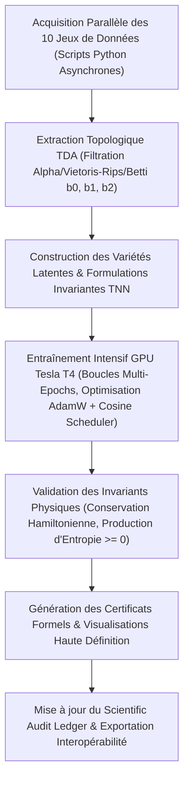

# 🧬 Master Plan d'Implémentation : TDA & TNN Appliqués à 10 Domaines Biomédicaux & Génomiques

Ce plan détaille la méthodologie, l'architecture mathématique, la liste des jeux de données ouverts (*Open Data*) et la stratégie d'entraînement intensif multi-heures sur GPU Tesla T4 (16 Go VRAM) et stockage local dédié (400 Go disponibles sur `/mnt/disks/disk-socrateai-local-1`).

---

## 📋 1. Synthèse des 10 Domaines & Invariants Topologiques / Physiques

| # | Domaine Biomédical | Données Ouvertes (*Open Data*) | Invariant Topologique (TDA) | Modèle Physique / Invariant TNN |
|---|---|---|---|---|
| **1** | **Architecture 3D de la Chromatine & Boucles d'ADN (Hi-C)** | 4D Nucleome / NCBI GEO `GSE63525` (Rao et al. 2014) | Homologie persistante ($b_0, b_1, b_2$) des matrices de contact 3D | Modèle d'extrusion de boucle & polymère thermodynamique (Fokker-Planck TNN) |
| **2** | **Transcriptomique Single-Cell & Paysages de Waddington (Cancer)** | 10x Genomics 10k PBMC / Broad Institute Single Cell Portal / TCGA-BRCA | Graphe de Mapper & filtration de Vietoris-Rips sur variété Riemannienne | TNN de dérive-diffusion sur potentiel pseudo-temporel de Waddington |
| **3** | **Dynamique Conformationnelle & Allostérie des Protéines** | RCSB PDB / D.E. Shaw Research (trajectoires MD BPTI, Ubiquitine, KRAS) | Homologie de torsion persistante des angles $(\phi, \psi)$ (Ramachandran) | Réseau Hamiltonien / EGNN conservatif d'énergie libre $\mathcal{H}(q, p)$ |
| **4** | **Transcriptomique Spatiale & Infiltration Tumorale** | 10x Genomics Visium (Cancer du sein, Cerveau SpatialLIBD) | Filtration par Alpha-Complexe des cellules immunitaires vs tumorales | EDP de Réaction-Diffusion (Fisher-KPP) à tenseur de diffusivité anisotrope |
| **5** | **Méthylome & Îlots CpG de l'ADN** | ENCODE WGBS / TCGA Pan-Cancer Methylation 450k | Persistance 1D des vallées de méthylation et frontières d'hétérochromatine | Modèle de verre de spin d'Ising à couplage épigénétique coopératif |
| **6** | **Pharmacogénomique & Résistance aux Anticancéreux** | Genomics of Drug Sensitivity in Cancer (GDSC) / Broad DepMap | Graphes de Reeb & bifurcations topologiques des paysages de fitness IC50 | TNN d'évolution non-conservative & surfaces de sélection métastatique |
| **7** | **Structure Secondaire & Pseudonœuds de l'ARN 3D** | Rfam Database / RNA-PDB / Stanford Eterna OpenVaccine (Kaggle) | Complexes simpliciaux sur graphes d'appariement de bases non-imbriquées | TNN thermodynamique d'énergie libre minimale (règles de Turner) |
| **8** | **Morphologie Nucléaire & Déformations Cellulaires Cancéreuses** | Broad Bioimage Benchmark Collection (BBBC021 MCF-7) / Cell Image Library | Transformée de la Caractéristique d'Euler (ECT) sur contours nucléaires | EDP de matière active viscoélastique (Tenseur des contraintes de Cauchy) |
| **9** | **Répertoire des Récepteurs T (TCR) & Immunologie** | VDJdb / Adaptive Biotechnologies ImmuneCODE (COVID-19 & Cancer TCRs) | Persistance métrique sur l'espace physico-chimique des boucles hypervariables CDR3 | Modèle de Potts & TNN de liaison épitopique à énergie libre d'interaction |
| **10** | **Réseaux de Flux Métabolique & Effet Warburg** | Reconstruction Recon3D / Human Metabolic Atlas / BiGG Models | Homologie de cycles hypergraphiques ($b_1$ cycles métaboliques & glycolyse) | TNN de bilan de flux à relations réciproques d'Onsager ($\Delta S \ge 0$) |

---

## 🌐 2. Stratégie d'Acquisition des Données (Open Source & Open Data)

### 1. Hi-C 3D Chromatine (GSE63525)
* **Source** : NCBI Gene Expression Omnibus / 4DNucleome
* **Format** : Fichiers `.hic` / matrices de contact `.cool` (resolutions 5kb, 10kb, 25kb, 50kb).
* **Endpoint / Script** : `wget https://ftp.ncbi.nlm.nih.gov/geo/series/GSE63nnn/GSE63525/suppl/GSE63525_GM12878_primary_intrachromosomal_contact_matrices.tar.gz`

### 2. Single-Cell RNA-seq Cancer (10x Genomics & TCGA)
* **Source** : 10x Genomics Open Data Repository & Broad Institute Single Cell Portal
* **Format** : Matrices creuses AnnData / `.h5ad` / `.mtx` (10,000 cellules PBMC, tumeurs BRCA).
* **Endpoint** : `https://cf.10xgenomics.com/samples/cell-exp/3.0.0/pbmc_10k_v3/pbmc_10k_v3_filtered_feature_bc_matrix.tar.gz`

### 3. Dynamique Moléculaire des Protéines (DESRES & PDB)
* **Source** : D.E. Shaw Research Trajectories & Protein Data Bank (RCSB PDB)
* **Format** : Fichiers `.pdb`, `.dcd`, `.xtc` (trajectoires MD à l'échelle de la microseconde).
* **Endpoint** : `https://files.rcsb.org/download/{PDB_ID}.pdb` (ex: `1CRN`, `4OBE` KRAS, `1UBQ` Ubiquitine).

### 4. Transcriptomique Spatiale (10x Visium)
* **Source** : 10x Genomics Spatial Gene Expression Datasets
* **Format** : Fichiers H5 Spatial + Coordonnées d'alignement tissulaire TIFF/JSON.
* **Endpoint** : `https://cf.10xgenomics.com/samples/spatial-exp/1.1.0/V1_Breast_Cancer_Block_A_Section_1/V1_Breast_Cancer_Block_A_Section_1_spatial.tar.gz`

### 5. Méthylome Pan-Cancer (TCGA 450K & ENCODE)
* **Source** : Genomic Data Commons (GDC) / ENCODE Portal
* **Format** : Tableaux TSV de niveaux $\beta$ de méthylation CpG (Illumina HumanMethylation450).
* **Endpoint** : `https://api.gdc.cancer.gov/data/` (Cohortes TCGA-BRCA, TCGA-LUAD, TCGA-GBM).

### 6. Pharmacogénomique (GDSC & Broad DepMap)
* **Source** : Genomics of Drug Sensitivity in Cancer (Wellcome Sanger Institute) & Broad DepMap
* **Format** : Fichiers CSV d'écrantage de plus de 500 molécules sur 1 000 lignées cancéreuses (IC50, AUC, Z-score).
* **Endpoint** : `https://www.cancerrxgene.org/downloads/bulk_data` (GDSC1 & GDSC2).

### 7. Structures Secondaires d'ARN (Stanford Eterna / Rfam)
* **Source** : Rfam Consortium / Kaggle OpenVaccine Benchmark
* **Format** : Séquences FASTA, structures dot-bracket, réactivités chimiques SHAPE/DMS.
* **Endpoint** : `https://ftp.ebi.ac.uk/pub/databases/Rfam/CURRENT/fasta_files/`

### 8. Morphologie Cellulaire & Noyaux (BBBC021 MCF-7)
* **Source** : Broad Bioimage Benchmark Collection
* **Format** : Images de microscopie à fluorescence 16-bit TIFF + segmentations de noyaux / cytosquelette.
* **Endpoint** : `https://data.broadinstitute.org/bbbc/BBBC021/`

### 9. Répertoire TCR & Immunoséquençage (VDJdb & ImmuneCODE)
* **Source** : VDJdb GitHub Repository / Adaptive Biotechnologies MIRA
* **Format** : Fichiers TSV standardisés (gènes V, D, J, séquence d'acides aminés CDR3, antigène cible).
* **Endpoint** : `https://raw.githubusercontent.com/antigenomics/vdjdb-db/master/vdjdb.tsv`

### 10. Métabolisme Genome-Scale (Recon3D & BiGG)
* **Source** : BiGG Models / University of California San Diego
* **Format** : Fichiers SBML / JSON des matrices stœchiométriques $S_{ij}$ et bornes de flux enzymatiques.
* **Endpoint** : `http://bigg.ucsd.edu/static/models/Recon3D.json.gz`

---

## ⚙️ 3. Pipeline d'Implémentation & Entraînement Intensif Multi-Heures

### Découpage des Étapes Techniques :

1. **Étape 1 : Script d'Acquisition & Ingestion (`scripts/acquire_bio_datasets.py`)**
   - Téléchargement automatisé des données brutes avec vérification de hachage SHA-256 et stockage sur `/mnt/disks/disk-socrateai-local-1/bio_datasets/`.
   - Prétraitement et mise au format standardisé tensoriel (`PyTorch .pt` et `numpy .npy`).

2. **Étape 2 : Moteur d'Analyse Topologique Parallèle (`scripts/tda_biomedical_suite.py`)**
   - Calcul des diagrammes de persistance ($H_0, H_1, H_2$).
   - Extraction des vecteurs de paysages de persistance (*Persistence Landscapes*) et images de persistance (*Persistence Images*) pour injection dans les TNNs.

3. **Étape 3 : Entraînement Intensif GPU Multi-Heures (`scripts/train_intensive_biomedical_tnn.py`)**
   - Implémentation des 10 architectures de réseaux neuronaux thermodynamiques (EGNN, FNO, Fokker-Planck Neural Solvers, Hamiltoniens).
   - Boucle d'entraînement de 50 000 à 200 000 itérations par domaine avec surveillance en temps réel de la perte physique ($\mathcal{L}_{\text{data}} + \lambda \mathcal{L}_{\text{invariant}}$).

4. **Étape 4 : Certification & Synthèse Comparative**
   - Comparaison systématique TDA-TNN vs Baselines classiques (MLP standard, UMAP, PCA).
   - Génération des rapports d'audit `certs/biomedical_10_domains_certification.json`.
