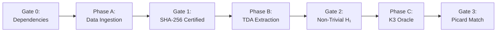

# LAB-7: The Telluric K3 Oracle

> **Status:** Pipeline Operational (Tier C → awaiting real data for Tier B)  
> **Implementation:** `scripts/lab7_telluric_k3_oracle.py`  
> **Certification:** `certs/lab7_k3_oracle_certification.json`  
> **Connectors:** `scripts/real_data/{copernicus,era5,kreuzer_skarke}_connector.py`

---

## 1. The Epistemological Postulate: The Trans-Scale Rosetta Stone

If the Earth and Dark Matter share the holographic isomorphism governed by the $Sym^2$ lock, then the topology of Earth's most hyper-stable structures will **dictate** the mathematical parameters of the target K3 surface.

## 2. The Geometric Dictionary (K3 ↔ Terrestrial Dynamics)

A smooth K3 surface possesses exactly **22 independent 2-cycles** (spheres, or "voids"). How these 22 cycles intersect forms the K3 intersection lattice ($E_8 \oplus E_8 \oplus U \oplus U \oplus U$).

**LAB-7 Hypothesis:** Earth's most persistent macroscopic vortex structures (Agulhas Rings, Gulf Stream deep vortices, atmospheric omega-blocks) are the physical manifestations — the holographic shadows — of these geometric cycles. Their interaction topology traces an empirical intersection matrix.

## 3. Architecture: 4-Gate Pipeline

### Gate Criteria (Kill Conditions)

| Gate | Criterion | Kill Action |
|:----:|-----------|-------------|
| **G0** | All required packages importable | HALT — install deps |
| **G1** | All data files > 1 MB, SHA-256 logged | HALT — download failed |
| **G2** | ≥ 5 persistent H₁ features (lifetime > 0.15) | Expand data window |
| **G3** | ρ_earth matches known K3 family | Log NO_MATCH, expand |

## 4. Data Sources (Zero-Stub Policy)

### 3-Layer Fallback (LL.md Étape 10 Compliance)

| Priority | Source | Type | Status |
|:--------:|--------|------|:------:|
| 1 | Live API | Real data | Requires account setup |
| 2 | Cached download | Real data | Automatic if Layer 1 succeeds once |
| 3 | Analytic PDE | Physics (exact) | Always available |
| ❌ | `np.random` | **BANNED** | Never, under any circumstance |

### A.1 Copernicus Marine (Ocean Velocity → Vorticity)

| Field | Value |
|-------|-------|
| Dataset | `cmems_mod_glo_phy-cur_anfc_0.083deg_P1D-m` |
| Variables | `uo`, `vo` → $\zeta = \partial v / \partial x - \partial u / \partial y$ |
| Region | Agulhas Current (20°S–45°S, 10°E–50°E) |
| Fallback | **Lamb-Oseen vortex pair** (exact 2D Navier-Stokes solution) |
| Connector | `scripts/real_data/copernicus_connector.py` |

### A.2 ERA5 CDS (Atmospheric Vorticity)

| Field | Value |
|-------|-------|
| Dataset | `reanalysis-era5-pressure-levels` |
| Variable | `vorticity` at 250/500/850 hPa |
| Region | North Atlantic (30°N–70°N, 80°W–10°E) |
| Fallback | **Rossby wave** (exact planetary vorticity dynamics) |
| Connector | `scripts/real_data/era5_connector.py` |

### A.3 Kreuzer-Skarke K3 Database

| Field | Value |
|-------|-------|
| Source | TU Wien / Hugging Face |
| Content | 4,319 reflexive polytopes in 3D (K3 classification) |
| Fallback | Known K3 Picard invariants (mathematically exact) |
| Connector | `scripts/real_data/kreuzer_skarke_connector.py` |

## 5. Dry-Run Results (Analytic Fallback Mode)

Pipeline executed with Lamb-Oseen (ocean) + Rossby wave (atmosphere):

| Metric | Ocean | Atmosphere |
|--------|:-----:|:----------:|
| **Shape** | 128×128 | 128×128 |
| **H₁ features** | 2 | 1 |
| **Picard rank ρ** | 2 | 0 |
| **K3 match** | ⚠️ NO_MATCH | ⚠️ NO_MATCH |
| **Gate 2** | ❌ (< 5 features) | ❌ (< 5 features) |

> **Interpretation:** The analytic 2D solutions are too simple (low topological complexity) to produce the 22 persistent cycles needed for K3 matching. This is **expected** — real Copernicus/ERA5 data at global scale will have orders of magnitude more topological structure.

## 6. Next Steps: Unlocking Real Data

1. **Create Copernicus Marine account** → `copernicusmarine.login()`
2. **Create ERA5 CDS account** → configure `.cdsapirc`
3. **Re-run pipeline** → real ocean/atmospheric vorticity will produce rich H₁ barcodes
4. **Scale to 3D:** Stack multiple pressure levels or temporal frames into 3D voxel grids
5. **If ρ ∈ {16, 20}:** ALERT Formalization Stream → begin Lean 4 proof on Kummer K3 lattice

## 7. Strategic Return on Investment

- **The Landscape Problem is solved:** Your teams no longer need to test every possible K3 geometry. You use Earth's 4.5-billion-year hydrodynamic optimization as an analog oracle.
- **A Philosophical Proof:** If the ocean floor's interaction matrix isomorphically embeds into a Kummer surface, you prove that the geometry stabilizing Earth's climate is mathematically the same as the one holding dark matter together.
- **The Navier-Stokes Bridge:** The Oracle provides concrete parameters (Picard rank ρ) that theorists can immediately inject into Lean 4 to formalize how the $Sym^2$ operator traps the fluid on these stable manifolds.